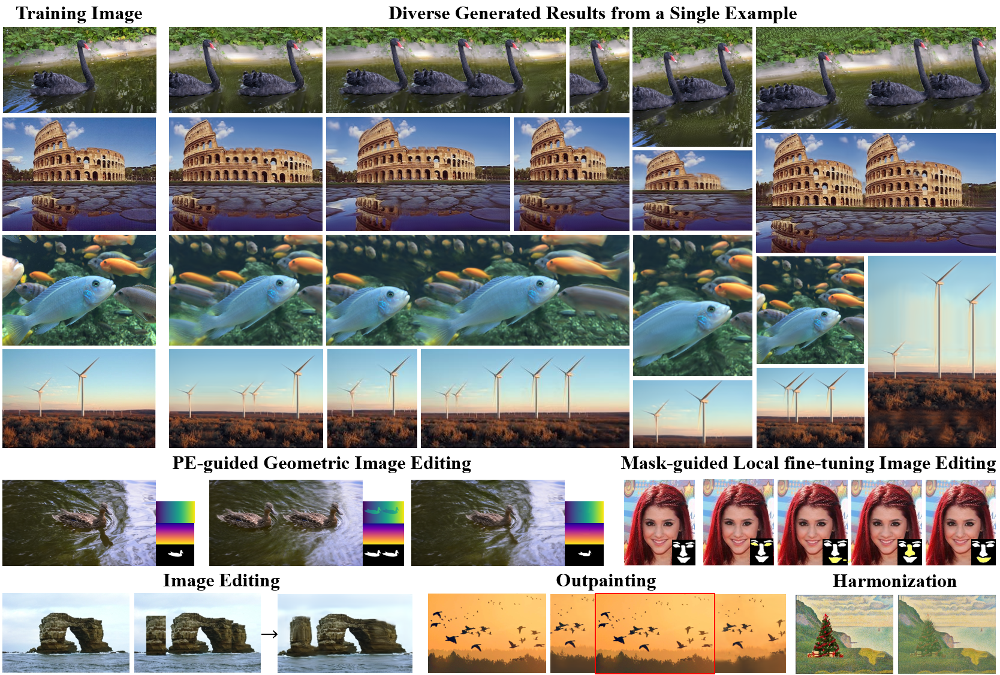

# StructDiff

<p align="center">
  <strong>StructDiff: A Structure-Preserving and Spatially Controllable Diffusion Model for Single-Image Generation</strong>
</p>

<p align="center">
  Yinxi He<sup>1</sup>, Kang Liao<sup>2</sup>, Chunyu Lin<sup>1</sup>, Tianyi Wei<sup>2</sup>, Yao Zhao<sup>1</sup>
</p>

<p align="center">
  <sup>1</sup>Beijing Jiaotong University &nbsp;&nbsp; <sup>2</sup>Nanyang Technological University
</p>

<p align="center">
  Accepted by <strong>IEEE Transactions on Multimedia 2026</strong>
</p>

<p align="center">
  <a href="https://butter-crab.github.io/StructDiff/">Project Page</a> ·
  <a href="https://arxiv.org/pdf/2604.12575">Paper PDF</a> ·
  <a href="https://arxiv.org/abs/2604.12575">arXiv</a> ·
  <a href="https://huggingface.co/datasets/ButterCrab0122/Mulmini-NL">Dataset</a>
</p>



StructDiff is a single-image diffusion framework for structure-preserving generation and editing. This release focuses on a clean, image-only pipeline with:

- diverse generation by default
- optional 3D positional encoding for spatial control
- text-guided, reference-guided, and outpainting sampling modes
- an interactive SAM2-based mask tool for foreground mask creation

## Installation

### Core environment

Use a fresh Python 3.9 environment for training and sampling:

```bash
conda create -n structdiff python=3.9
conda activate structdiff
pip install -r requirements.txt
```

### Mask tool environment

The SAM2 mask editor uses a separate environment. The full setup and launch instructions are documented in [docs/mask_tool/README.md](docs/mask_tool/README.md).

## Documentation

The repository keeps detailed usage notes in focused sub-guides so the top-level README can stay compact:

- [Data Guide](docs/data/README.md): dataset layout, naming rules, mask conventions, and loader behavior
- [Mask Tool Guide](docs/mask_tool/README.md): SAM2 environment setup, launch commands, UI workflow, and mask saving paths

## Default Model

The default StructDiff model is trained **without positional encoding**. This is the recommended starting point for diverse generation and the downstream application modes that do not require spatial control.

### Training

```bash
python main.py --image_name mountains3.jpg --run_name mountains3_default
```

### Sampling

Supported sampling modes for the default model:

- `diverse`: default diverse single-image generation
- `text`: text-guided generation with CLIP guidance
- `reference`: reference-guided generation
- `outpaint`: outpainting around an input image

Example commands:

```bash
python sample.py --image_name mountains3.jpg --run_name mountains3_default --sample_mode diverse
python sample.py --image_name mountains3.jpg --run_name mountains3_default --sample_mode text --text_input "volcano eruption"
python sample.py --image_name mountains3.jpg --run_name mountains3_default --sample_mode reference
python sample.py --image_name mountains3.jpg --run_name mountains3_default --sample_mode outpaint --sample_size 320,320 --outpaint_offset 32,74
```

Each sampling command assumes that the matching image-specific default checkpoint has already been trained first.

## Positional-Encoding Model

The PE version is trained with the paper's 3D positional encoding and is intended for spatially controllable generation.

### Training

```bash
python main.py --image_name blackswan.jpg --run_name blackswan_pe --use_positional_encoding
```

### Sampling

PE checkpoints are sampled in `control` mode:

- `control_action none`: keep the original positional encoding and sample the source layout
- `control_action shift`: move the controlled foreground region
- `control_action copy_shift`: duplicate and move the foreground region
- `control_action scale`: resize the controlled foreground region

Example commands:

```bash
python sample.py --image_name blackswan.jpg --run_name blackswan_pe --use_positional_encoding --sample_mode control --control_action none
python sample.py --image_name blackswan.jpg --run_name blackswan_pe --use_positional_encoding --sample_mode control --control_action shift --shift_x 24 --shift_y -12
python sample.py --image_name blackswan.jpg --run_name blackswan_pe --use_positional_encoding --sample_mode control --control_action copy_shift --shift_x 40 --shift_y 0
python sample.py --image_name blackswan.jpg --run_name blackswan_pe --use_positional_encoding --sample_mode control --control_action scale --scale_factor 0.6
```

For finer local control, especially on face images, use a prepared mask variant:

```bash
python sample.py --image_name face_3.jpg --run_name face_3_pe --use_positional_encoding --sample_mode control --mask_variant face_3_mask_change0.png --control_action none
```

This mask-variant workflow is useful for localized edits where you want to manipulate only part of the foreground rather than the full object region.


## Citation

```bibtex
@article{he2026structdiff,
  title={StructDiff: A Structure-Preserving and Spatially Controllable Diffusion Model for Single-Image Generation},
  author={He, Yinxi and Liao, Kang and Lin, Chunyu and Wei, Tianyi and Zhao, Yao},
  journal={IEEE Transactions on Multimedia},
  year={2026}
}
```

## Acknowledgements

This project builds on or is inspired by several open-source efforts, including [denoising-diffusion-pytorch](https://github.com/lucidrains/denoising-diffusion-pytorch), [CLIP](https://github.com/openai/CLIP), [Text2LIVE](https://github.com/omerbt/Text2LIVE), [SAM2](https://github.com/facebookresearch/sam2), and [GeoDiffuser](https://github.com/RahulSajnani/GeoDiffuser).
