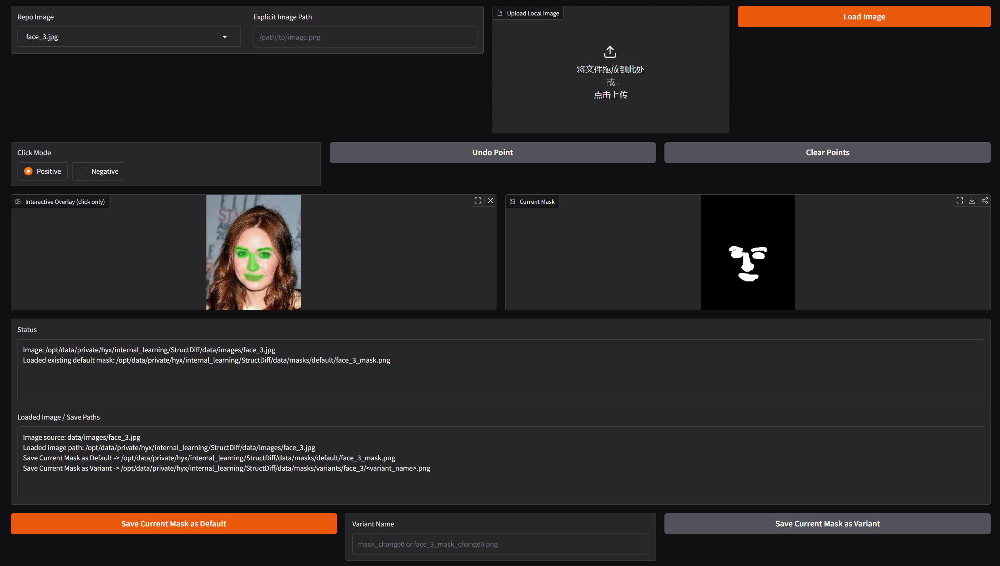

# StructDiff Mask Tool Guide

StructDiff provides an interactive SAM2-based mask editor in [`mask_tool.py`](../../mask_tool.py). It can load repository images from `data/images/`, accept a local upload, or open an explicit local file path.



## Overview

The editor supports a simple point-based workflow:

- add positive points to include foreground regions
- add negative points to exclude background regions
- undo the last point or clear the full prompt set
- download the current mask preview from the browser
- save the current mask as a project default mask or as a named variant

## Environment Setup

Use a separate Python 3.10 environment for the mask tool:

```bash
conda create -n structdiff-mask python=3.10 -y
conda activate structdiff-mask
pip install torch==2.5.1 torchvision==0.20.1 torchaudio==2.5.1 --index-url https://download.pytorch.org/whl/cu121
pip install -r requirements_mask.txt
mkdir -p sam2/checkpoints
wget https://dl.fbaipublicfiles.com/segment_anything_2/092824/sam2.1_hiera_large.pt -O sam2/checkpoints/sam2.1_hiera_large.pt
```

For CPU-only installation, replace the PyTorch line with:

```bash
pip install torch==2.5.1 torchvision==0.20.1 torchaudio==2.5.1 --index-url https://download.pytorch.org/whl/cpu
```

## Launch

Run the tool from the project root:

```bash
python mask_tool.py --image_name face_3.jpg
```

To use a checkpoint outside the default location:

```bash
python mask_tool.py --image_name face_3.jpg --sam2_checkpoint /path/to/sam2.1_hiera_large.pt
```

Useful options:

- `--image_name`: initial repo image name or local image path
- `--sam2_checkpoint`: explicit SAM2 checkpoint path
- `--sam2_config`: config file used with the checkpoint
- `--device`: force `cuda` or `cpu`
- `--host`: local Gradio host, default `127.0.0.1`
- `--port`: local Gradio port, default `7861`
- `--share`: enable Gradio share mode

## Interface

The main controls are:

- `Repo Image`: choose an image from `data/images/`
- `Explicit Image Path`: load any local image by path
- `Upload Local Image`: load a local image through the browser
- `Click Mode`: switch between positive and negative prompts
- `Undo Point`: remove the last prompt
- `Clear Points`: reset all prompts and the current prediction
- `Current Mask`: preview panel with a built-in download button
- `Loaded Image / Save Paths`: shows the active image and the project save destinations

## Recommended Workflow

1. Load an image.
2. Add one or two positive points on the target foreground.
3. Add negative points where the mask should be removed.
4. Refine with more positive and negative points if needed.
5. Download the current preview or save it into the project.

The editor keeps the highest-scoring SAM2 candidate for the current prompt set.

## Saving Results

There are two ways to keep the current result.

### Download

Use the download button in the `Current Mask` panel to save the preview directly from the browser.

### Save Into The Project

Use one of these actions:

- `Save Current Mask as Default`
- `Save Current Mask as Variant`

Saved paths:

- default mask: `data/masks/default/<image_stem>_mask.png`
- variant mask: `data/masks/variants/<image_stem>/<image_stem>_<variant_name>.png`

`Save Current Mask as Default` always means the mask currently shown in `Current Mask`.

## Notes

- unreadable repository images are filtered out of the dropdown
- mismatched old masks are ignored instead of causing a load failure
- uploaded or external images use their basename to derive the output filename
